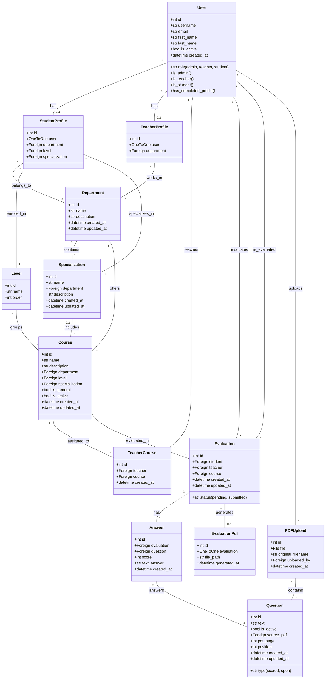
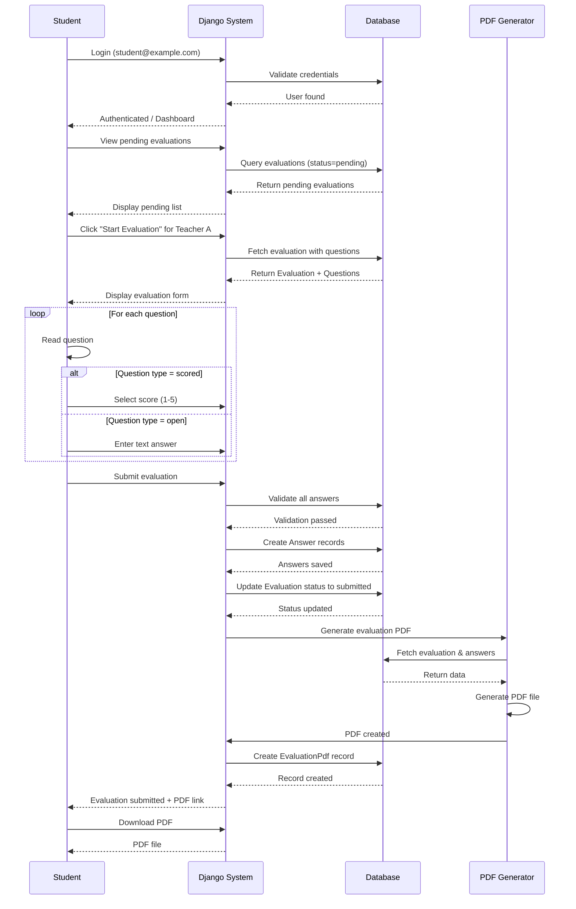
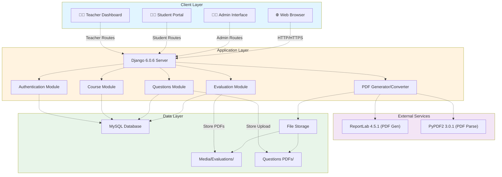

# Evaluation System - UML Diagrams

## 1. Class Diagram

The core data model showing all entities and their relationships.

---

## 2. Sequence Diagram

The workflow of a student completing an evaluation.

---

## 3. Use Case Diagram

The actors and their interactions with the system.

```mermaid
graph TB
    subgraph Actors
        Admin["👨‍💼 Admin"]
        Teacher["👨‍🏫 Teacher"]
        Student["👨‍🎓 Student"]
    end

    subgraph StudentUseCases["Student Use Cases"]
        SUC1["Register / Login"]
        SUC2["Complete Profile"]
        SUC3["View Pending Evaluations"]
        SUC4["Answer Evaluation"]
        SUC5["Submit Evaluation"]
        SUC6["Download Evaluation PDF"]
        SUC7["View Evaluation Results"]
    end

    subgraph TeacherUseCases["Teacher Use Cases"]
        TUC1["Login"]
        TUC2["View Assigned Courses"]
        TUC3["View Student Evaluations"]
        TUC4["View Ranking/Statistics"]
    end

    subgraph AdminUseCases["Admin Use Cases"]
        AUC1["Manage Departments"]
        AUC2["Manage Specializations"]
        AUC3["Manage Levels"]
        AUC4["Manage Courses"]
        AUC5["Manage Teachers"]
        AUC6["Manage Questions"]
        AUC7["Manage Evaluations"]
        AUC8["Upload Question PDFs"]
    end

    Student -.-> SUC1
    Student -.-> SUC2
    Student -.-> SUC3
    Student -.-> SUC4
    Student -.-> SUC5
    Student -.-> SUC6
    Student -.-> SUC7

    Teacher -.-> TUC1
    Teacher -.-> TUC2
    Teacher -.-> TUC3
    Teacher -.-> TUC4

    Admin -.-> AUC1
    Admin -.-> AUC2
    Admin -.-> AUC3
    Admin -.-> AUC4
    Admin -.-> AUC5
    Admin -.-> AUC6
    Admin -.-> AUC7
    Admin -.-> AUC8

    SUC1 -.includes.-> SUC2
    SUC4 -.includes.-> SUC5
    SUC5 -.includes.-> SUC6
```

---

---

## 4. Deployment Diagram

Architecture and deployment of the application.

